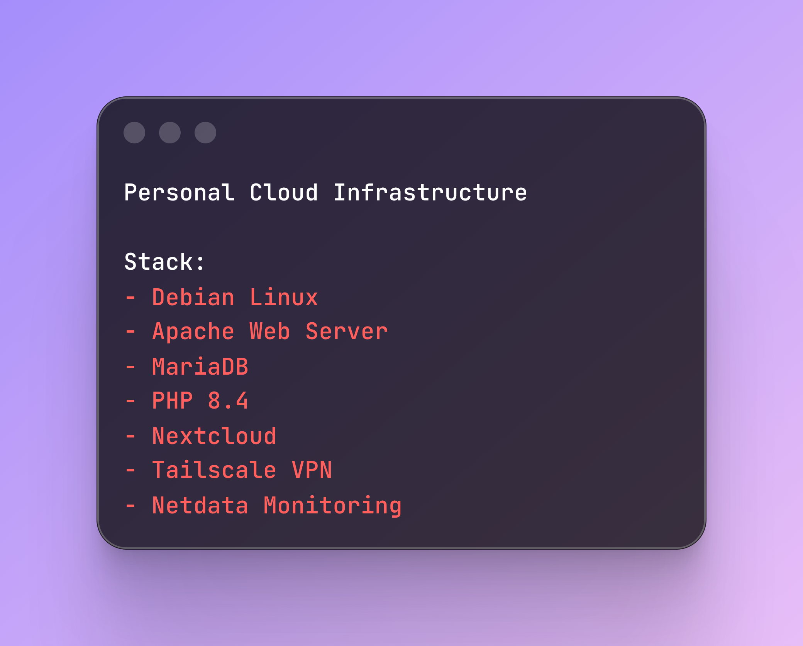
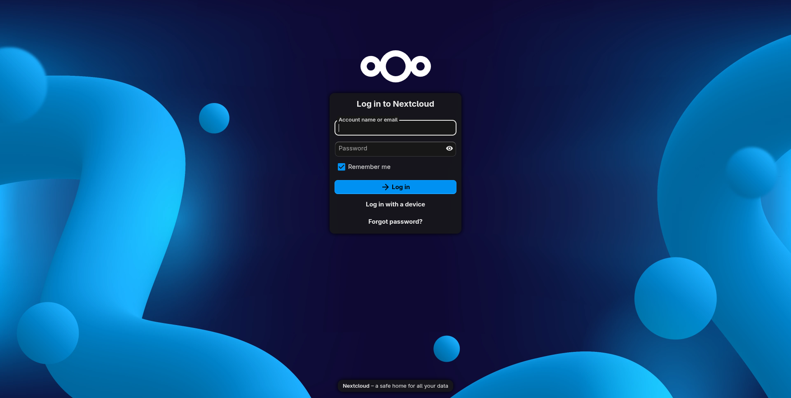
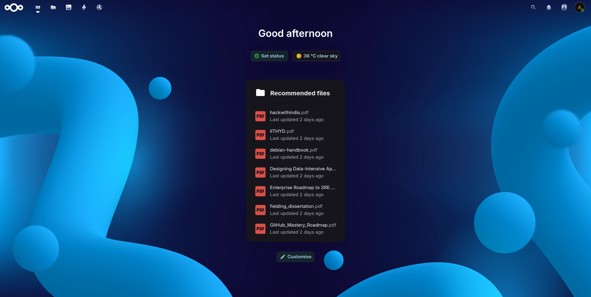
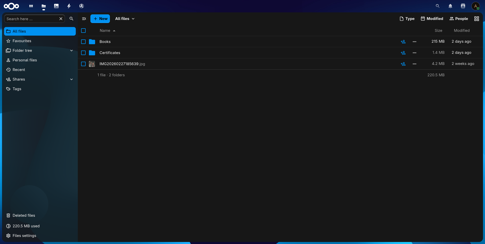
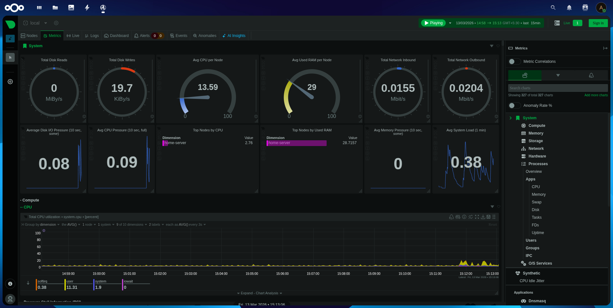
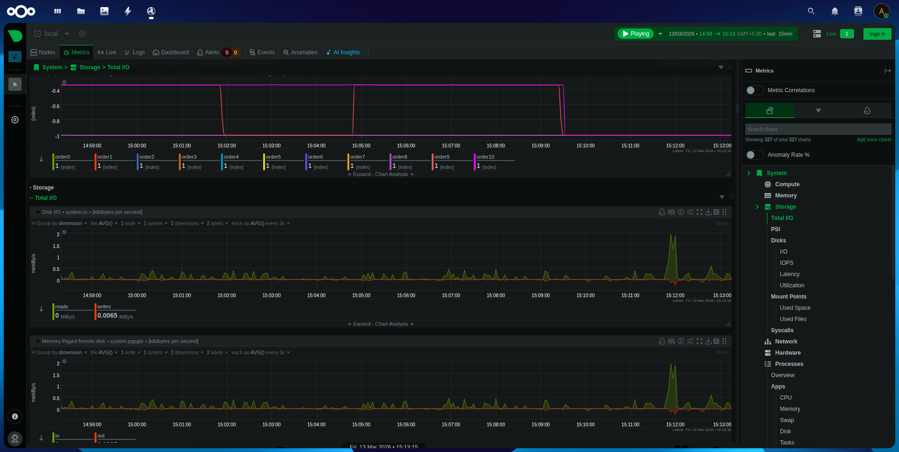

<p align="center">
  
</p>

# Personal Cloud Infrastructure


A self-hosted private cloud built using **Nextcloud, Apache, MariaDB, and Tailscale** on a repurposed Debian server.

This project demonstrates how to build and operate a **secure personal cloud storage system** with remote access, monitoring, backups, and detailed operational documentation.

---

# Overview

This system provides a self-hosted cloud platform where users can:

- store files securely
- access data from multiple devices
- share files with other users
- monitor server health
- maintain full control over their infrastructure

The system is deployed on a **repurposed laptop running Debian Linux** and is accessible securely through **Tailscale VPN**.

---

## Project Motivation

This project was built to explore the design and operation of a
self-hosted cloud infrastructure using open-source tools.

The goal was to build a system that provides:

- secure remote file access
- infrastructure automation
- operational monitoring
- clear technical documentation

while maintaining full control over the underlying hardware and software stack.

---

# Architecture

```
User Device
│
│ Encrypted Connection
▼
Tailscale VPN
│
▼
Apache Web Server
│
▼
Nextcloud Application
│
▼
MariaDB Database
│
▼
Storage Disk (/storage)

```
Detailed architecture documentation is available here: [architecture.md](docs/architecture.md)

---

# Key Features

| Feature | Description |
|-------|-------------|
| Self-Hosted Cloud | Private file storage using Nextcloud |
| Secure Remote Access | Tailscale VPN connectivity |
| Dedicated Storage Disk | Separate disk for user data |
| Monitoring | Real-time server monitoring with Netdata |
| Automated Setup | Deployment scripts and Makefile |
| Documentation | Full infrastructure documentation |

---

# Technology Stack

| Component | Technology |
|----------|-----------|
| Operating System | Debian Linux |
| Cloud Platform | Nextcloud |
| Web Server | Apache |
| Database | MariaDB |
| Runtime | PHP 8.4 |
| VPN | Tailscale |
| Monitoring | Netdata |

---

# Repository Structure

See the full repository layout here: [project_structure.md](project_structure.md)

---

# Installation

The project includes automation scripts to simplify deployment.

Clone the repository:

```bash
git clone <repository-url>
cd personal-cloud
```

Run installation using the Makefile:

```
make file
```

This will execute:

- Dependency Installation
- Database Setup
- Nextcloud Installation

Detailed Installation Instructions: [installation.md](docs/installation.md)

# Networking and Remote Access

Remote access is provided through **Tailscale**, which creates a secure private network between devices.

The server is not exposed to the public internet, reducing attack surface.

More Details: [networking.md](docs/networking.md) & [remote_access.md](docs/remote_access.md)

---

# Monitoring

Server health and performance metrics are measured using Netdata.

Metrics Include:

- CPU Usage
- Memory Usage
- Disk I/O
- Network Traffic

Monitoring Details: [monitoring.md](docs/monitoring.md)

---

# Security

Security Features Include:

- VPN-only access via Tailscale
- HTTPS Encryption
- Restricted Apache permissions
- Database isolation
- Secure configuration practices

Security Documentation: [security.md](docs/security.md)

---

# Operations

Operational procedures for maintaning the server include:

- Service Management
- Configuration Deployment
- Nextcloud CLI Operations
- Log Inspection

Operations Guide: [operations.md](docs/operations.md)

---

# Troubleshooting

Common issues encountered during deployment and their solutions are documented here: [troubleshooting.md](docs/troubleshooting.md)

---

# Screenshots

Screenshots of the deployed system:















---

# License

This project is licensed under the MIT License.

See the [LICENSE](LICENSE) file for details

---

# Learning Outcomes

This project demonstrates practical experience with:

- Linux System Administration
- Web Server Configuration
- Database Management
- VPN Networking
- Infrastructure Automation
- Monitoring and Operations

---

# Future Improvements

Potential enhancements include:

- Automated TLS certificates using Let's Encrypt
- Containerized deployment using Docker
- Automated CI/CD deployment
- Object storage Integration
- Advanced backup scheduling

---


